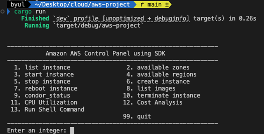

# Cloud Computing   
### AWS 동적 자원 관리 프로그램   
- 위 프로그램은 Rust로 개발된 AWS 동적 자원 관리 프로그램입니다.
- 총 13 개의 기능을 제공합니다.
    - **기본 기능**
        - EC2 인스턴스 목록 조회: AWS EC2에 생성되어 있는 모든 인스턴스 목록을 출력합니다
        - EC2 인스턴스 시작: 입력한 ID의 인스턴스를 실행합니다
        - EC2 인스턴스 중지: 입력한 ID의 인스턴스를 중지합니다
        - EC2 인스턴스 재부팅: 입력한 ID의 인스턴스를 재시작합니다
        - 새로운 EC2 인스턴스 생성: AMI를 활용하여 새로운 인스턴스를 생성합니다
        - 가용 영역(Availability Zones) 조회: 가용할 수 있는 Zones 정보를 출력합니다
        - 사용 가능한 리전(available regions) 조회: 사용 가능한 regions 정보를 출력합니다
        - AMI 목록 조회: AMI(Amazon Machine Images) 목록을 출력합니다
        - 종료
    - **추가 기능**
        - condor_status 명령 실행: 실행중인 인스턴스에서 condor_status 명령을 실행하여 현재 상태를 확인할 수 있습니다
        - EC2 인스턴스 종료(삭제): 입력한 ID의 인스턴스를 종료(삭제)합니다
        - CPU 사용량 (1시간 이내): 1시간 이내의 CPU 사용량을 출력합니다
        - 비용 분석(월 비용): 1일부터 현재까지의 사용한 서비스별 비용을 출력합니다
        - 쉘 커맨드 실행: 커맨드 명령어를 실행하고 결과를 출력합니다

## 실행 화면

- **초기 화면(menu)**
    
    

1. list instance

- 현재 config 파일의 profile_name의 계정이 접근 가능한 AWS EC2에 생성되어 있는 모든 인스턴스 목록을 출력합니다
- 현재 계정의 인스턴스 목록 화면 (AWS 콘솔)
    
    
    

1. available zones
    
    
    
    
    
    - 가용할 수 있는 Zones 정보를 출력합니다

1. start instance
    
    
    
    
    
    - 입력한 ID의 인스턴스의 상태를 실행합니다
    - 현재 계정의 인스턴스 목록 화면 (AWS 콘솔)
        
        
        
2. available regions
    
    
    
    - 사용 가능한 regions 정보를 출력합니다
    
3. stop instance
    
    
    
    
    
    - 입력한 ID의 인스턴스를 중지합니다
    - 현재 계정의 인스턴스 목록 화면 (AWS 콘솔)
        
        
        
4. create instance
    
    
    
    
    
    
    
    
    
    - AMI ID를 입력하여 새로운 인스턴스를 생성합니다. (생성된 인스턴스 ID 출력)
    - 현재 계정의 인스턴스 목록 화면 (AWS 콘솔)
        
        
        
    
5. reboot instance
    
    
    
    
    
    - 입력한 ID의 인스턴스를 재시작합니다

1. list images
    
    
    
    
    
    - AMI(Amazon Machine Images) 목록을 출력합니다

1. condor_status
    
    
    
    
    
    
    
    - 실행중인 인스턴스에서 **condor_status 명령**을 실행하여 **현재 condor 상태를 확인**할 수 있습니다
    - 현재 실행중인 인스턴스
        
        
        
    - i-0d3496d60e753517b 는 별도의 AMI를 사용중으로 condor_status에 확인되지 않음
        
        
        
    
2. terminate instance
    
    
    
    
    
    - 입력한 ID의 인스턴스를 종료합니다(삭제)
    - 현재 계정의 인스턴스 목록 화면 (AWS 콘솔)
        
        
        
        
        
        - 입력한 ID의 인스턴스가 shutting-down 상태임을 볼 수 있습니다.

1. CPI Utilization
    
    
    
    
    
    
    
    - 입력한 ID의 인스턴스의 1시간 이내의 **CPU 사용량**을 출력합니다
    
2. Cost Analysis
    
    
    
    
    
    
    
    - 1일부터 현재까지의 사용한 서비스별 비용을 출력합니다
    - AWS 콘솔의 비용 및 사용량
        
        
        

1. Run Shell Command
    
    
    
    
    
    
    
    - 커맨드 명령어를 실행하고 결과를 출력합니다

## 실행 방법

- **실행 조건**
    ~~~
    1. Rust 개발 환경이 설치 되어있어야 함.
    2. AWS SSO 설정을 한 상태여야 함.
    ~~~

**1. git clone**   

    git clone https://github.com/YOON331/aws-project

**2. 폴더 이동**   

    cd aws-project

**3. 실행**   

    cargo run